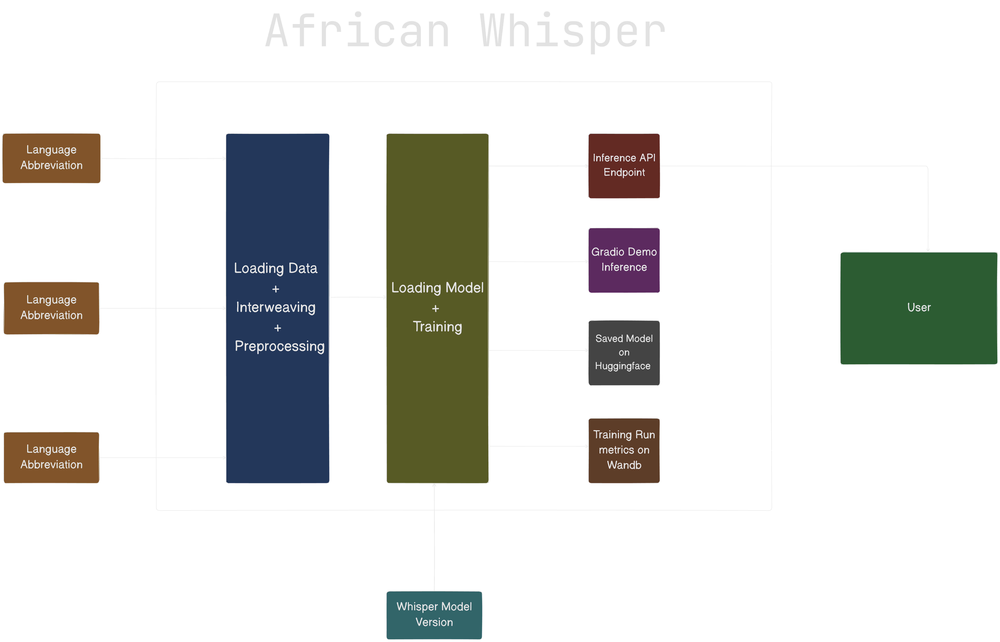

<h1 align="center">African Whisper: ASR for African Languages</h1>

  
  
  

<!-- 

    

 -->

*Framework for seamless fine-tuning and deploying Whisper Model developed to advance Automatic Speech Recognition (ASR): translation and transcription capabilities for African languages*.
 

# Features
  
- 🔧 **Fine-Tuning**: Fine-tune the [Whisper](https://huggingface.co/collections/openai/whisper-release-6501bba2cf999715fd953013) model on any audio dataset from Huggingface, e.g., [Mozilla's](https://huggingface.co/mozilla-foundation) Common Voice datasets.

- 📊 **Metrics Monitoring**: View training run metrics on [Wandb](https://wandb.ai/).

- 🐳 **Production Deployment**: Seamlessly containerize and deploy the model inference endpoint for real-world applications.

- 🚀 **Model Optimization**: Utilize CTranslate2 for efficient model optimization, ensuring faster inference times.

- 📝 **Word-Level Transcriptions**: Produce detailed word-level transcriptions and translations, complete with timestamps.

- 🎙️ **Multi-Speaker Diarization**: Perform speaker identification and separation in multi-speaker audio using diarization techniques.

- 🔍 **Alignment Precision**: Improve transcription and translation accuracy by aligning outputs with Wav2vec models.

- 🛡️ **Reduced Hallucination**: Leverage Voice Activity Detection (VAD) to minimize hallucination and improve transcription clarity.

# Research Implemented
 
The framework implements the following papers:
 

1. [Robust Speech Recognition via Large-Scale Weak Supervision](https://arxiv.org/abs/2212.04356) : Speech processing systems trained to predict large amounts of transcripts of audio on the internet scaled to 680,000 hours of multilingual and multitask supervision.

2. [WhisperX](https://arxiv.org/abs/2303.00747): Time-Accurate Speech Transcription of Long-Form Audio for time-accurate speech recognition with word-level timestamps. 

3. [Pyannote.audio](https://arxiv.org/abs/1911.01255): Neural building blocks for speaker diarization for advanced speaker diarization capabilities. 

4. [Efficient and High-Quality Neural Machine Translation with OpenNMT](https://arxiv.org/abs/1701.02810): Efficient neural machine translation and model acceleration.  

For more details, you can refer to the [Whisper ASR model paper](https://cdn.openai.com/papers/whisper.pdf). 
