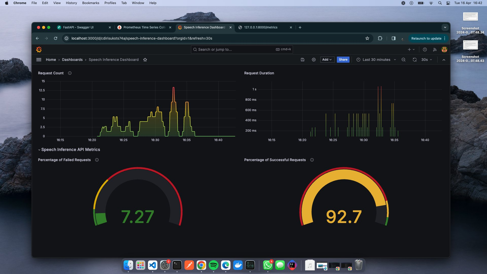

<h1 align="center">African Whisper: ASR for African Languages</h1>

<p align="center">
  <a href="https://twitter.com/AfriWhisper">
    
  </a>
  <a href="https://github.com/KevKibe/African-Whisper/commits/">
    
  </a>
  <a href="https://github.com/KevKibe/African-Whisper/blob/main/LICENSE">
    
  </a>

</p>

<p align="center">
    
</p>


*Enhancing Automatic Speech Recognition (ASR): translation and transcription capabilities for African languages by providing seamless fine-tuning and deploying pipelines for Whisper Model*.
<br>

## Features
  
- 🔧 Fine-tune the [Whisper](https://huggingface.co/collections/openai/whisper-release-6501bba2cf999715fd953013) model on any audio dataset from Huggingface, e.g., [Mozilla's](https://huggingface.co/mozilla-foundation) Common Voice datasets.

- 📊 View training run metrics on [Wandb](https://wandb.ai/).

- 🎙️ Test your fine-tuned model using Gradio UI or directly on an audio file (.mp3 or .wav).

- 🚀 Deploy an API endpoint for audio file transcription or translation.

- 🐳 Containerize your API endpoint application and push to DockerHub.

## Why Whisper? 🤔


- 🌐 **Extensive Training Data**: Trained on 680,000 hours of multilingual and multitask(translation and transcription) supervised data from the web.

- 🗣️ **Sequence-based Understanding**: Whisper considers the full sequence of spoken words, ensuring accurate context recognition, unlike Word2Vec.

- 💻 **Simplification for Applications**: Deploy one model for transcribing and translating a multitude of languages, without sacrificing quality or context.

For more details, you can refer to the [Whisper ASR model paper](https://cdn.openai.com/papers/whisper.pdf).<br>
Want proof, check this [repo](https://github.com/KevKibe/Finetuning-WhisperSmall-LoRA-Swahili)


# 🚀 Getting Started

## Prerequisites

- Sign up to HuggingFace and get your token keys use this [guide](https://huggingface.co/docs/hub/en/security-tokens).

- Sign up to Weights and Biases and get your token keys use this [guide](https://app.wandb.ai/login?signup=true)

- Demo video [here](https://youtu.be/qj48Chu4i4k?si=Vwv-6-qI7GJF7AMd)

[](https://colab.research.google.com/drive/16r4cxP-dSFplRTfgPLbzGXYRzBIUqpx9?usp=sharing)

## Step 1: Installation

```python
!pip install africanwhisper
# If you're on Colab, restart the session due to issue with numpy installation on colab.
```

## Step 2: Set Parameters

```python
# Set the parameters (refer to the 'Usage on VM' section for more details)
huggingface_read_token = " "
huggingface_write_token = " "
dataset_name = "mozilla-foundation/common_voice_16_1" 
language_abbr= [ ]                                    # Example `["ti", "yi"]`. see abbreviations here https://huggingface.co/datasets/mozilla-foundation/common_voice_16_1. 
                                                      # Note: choose a small dataset so as to not run out of memory,
model_id= "model-id"                                  # Example openai/whisper-small, openai/whisper-medium
processing_task= "automatic-speech-recognition" 
wandb_api_key = " "
use_peft = True                                       # Note: PEFT only works on a notebook with GPU-support.

```

## Step 3: Prepare the Model
```python
from training.data_prep import DataPrep

# Initialize the DataPrep class and prepare the model
process = DataPrep(
    huggingface_read_token,
    dataset_name,
    language_abbr,
    model_id,
    processing_task,
    use_peft
)
tokenizer, feature_extractor, feature_processor, model = process.prepare_model()

```

## Step 4: Preprocess the Dataset
```python
# Load and preprocess the dataset
processed_dataset = process.load_dataset(
    feature_extractor=feature_extractor,
    tokenizer=tokenizer,
    processor=feature_processor
)
```

## Step 5: Train the Model

```python
from training.model_trainer import Trainer

# Initialize the Trainer class and train the model
trainer = Trainer(
    huggingface_write_token,
    model_id,
    processed_dataset,
    model,
    feature_processor,
    feature_extractor,
    tokenizer,
    wandb_api_key,
    use_peft
)
trainer.train(
    max_steps=100,
    learning_rate=1e-3,
    per_device_train_batch_size=96,
    per_device_eval_batch_size=64,
    optim="adamw_bnb_8bit"
)

# Optional parameters for training:
#     max_steps (int): The maximum number of training steps (default is 100).
#     learning_rate (float): The learning rate for training (default is 1e-5).
#     per_device_train_batch_size (int): The batch size per GPU for training (default is 96).
#     per_device_eval_batch_size (int): The batch size per GPU for evaluation (default is 64).
#     optim (str): The optimizer used for training (default is "adamw_bnb_8bit")

```

## Step 6: Generate a Demo using GradioUI
```python
from training.gradio_inference import WhisperDemo

# Generate a demo
model_name = "your-finetuned-model-name-on-huggingface-hub"     # e.g., "KevinKibe/whisper-small-af"
demo = WhisperDemo(model_name, huggingface_read_token)
demo.generate_demo()
```

## Step 7: Test Model using Audio File

```python
from deployment.speech_inference import SpeechInference

model_name = "your-finetuned-model-name-on-huggingface-hub"   # e.g., "KevinKibe/whisper-small-af"
huggingface_read_token = " "
task = "desired-task"                                         # either 'translate' or 'transcribe'
audiofile_dir = "location-of-audio-file"                      # filetype should be .mp3 or .wav

# Initialize the SpeechInference class and run inference
inference = SpeechInference(model_name, huggingface_read_token)
pipeline = inference.pipe_initialization()
transcription = inference.output(pipeline, audiofile_dir, task)

# Access different parts of the output
print(transcription.text)                                       # The entire text transcription.
print(transcription.chunks)                                     # List of individual text chunks with timestamps.
print(transcription.timestamps)                                 # List of timestamps for each chunk.
print(transcription.chunk_texts)                                # List of texts for each chunk.

```

# 🖥️ Using the CLI

- Clone the Repository: Clone or download the application code to your local machine.
```bash
git clone https://github.com/KevKibe/African-Whisper.git
```

- Create a virtual environment for the project and activate it.
```bash
python3 -m venv env
source venv/bin/activate
```

- Install dependencies by running this command
```bash
pip install -r requirements.txt
```
- Navigate to:
```bash
cd src
```

- To start the training , use the following command:
```bash
python -m training.main --huggingface_read_token YOUR_HUGGING_FACE_READ_TOKEN_HERE --huggingface_write_token YOUR_HUGGING_FACE_WRITE_TOKEN_HERE --dataset_name AUDIO_DATASET_NAME --language_abbr LANGUAGE_ABBREVIATION --model_id MODEL_ID --processing_task PROCESSING_TASK --wandb_api_key YOUR_WANDB_API_KEY_HERE --use_peft # leave this out to opt-out of using PEFT
```
- Find a description of these commands [here](https://github.com/KevKibe/African-Whisper/blob/master/DOCS/PARAMETERS.md).

### Inference

- To get inference from your fine-tuned model, follow these steps:

- Ensure that ffmpeg is installed by running the following commands:

```bash
# on Ubuntu or Debian
sudo apt update && sudo apt install ffmpeg

# on Arch Linux
sudo pacman -S ffmpeg

# on MacOS using Homebrew (https://brew.sh/)
brew install ffmpeg

# on Windows using Chocolatey (https://chocolatey.org/)
choco install ffmpeg

# on Windows using Scoop (https://scoop.sh/)
scoop install ffmpeg
```

- To get the Gradio inference URL:
```bash
python -m training.gradio_demo --model_name YOUR_FINETUNED-MODEL --huggingface_read_token YOUR_HUGGING_FACE_READ_TOKEN_HERE 
```
- **--model_name**: Name of the fine-tuned model to use in your huggingfacehub repo. This should match the model's identifier on the Hugging Face Model Hub.
- **--huggingface_read_token**: Your Hugging Face authentication token for read access. It allows you to download datasets and models from Hugging Face.


```bash
cd src/deployment
```
- Create a `.env` file using `nano .env` command and add these keys and save the file.
```python
MODEL_NAME = "your-finetuned-model"
HUGGINGFACE_READ_TOKEN = "huggingface-read-token"
```

- To perform transcriptions and translations:

```bash
# If your model is peft finetuned
python -m deployment.peft_speech_inference_cli --audio_file audio-filename --task 

# If your model is fully finetuned
python -m deployment.speech_inference_cli --audio_file audio-filename --task task --perform_diarization --perform_alignment
```

## 🛳️ Deployment

- To deploy your fine-tuned model as a REST API endpoint, follow these [instructions](https://github.com/KevKibe/African-Whisper/blob/master/DOCS/deployment.md).


## Contributing 
Contributions are welcome and encouraged.

Before contributing, please take a moment to review our [Contribution Guidelines](https://github.com/KevKibe/African-Whisper/blob/master/DOCS/CONTRIBUTING.md) for important information on how to contribute to this project.

If you're unsure about anything or need assistance, don't hesitate to reach out to us or open an issue to discuss your ideas.

We look forward to your contributions!


## License
This project is licensed under the MIT License - see the [LICENSE](https://github.com/KevKibe/African-Whisper/blob/main/LICENSE) file for details.

## Contact
For any enquiries, please reach out to me through keviinkibe@gmail.com
